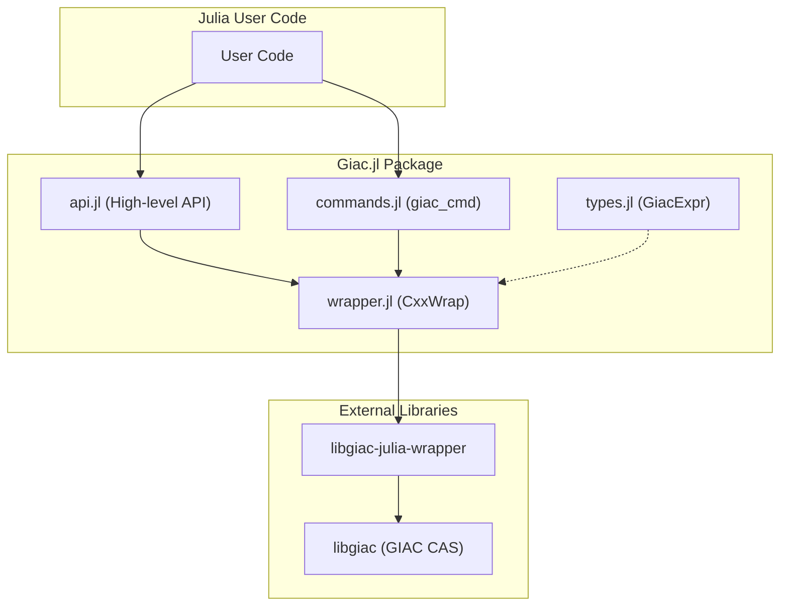
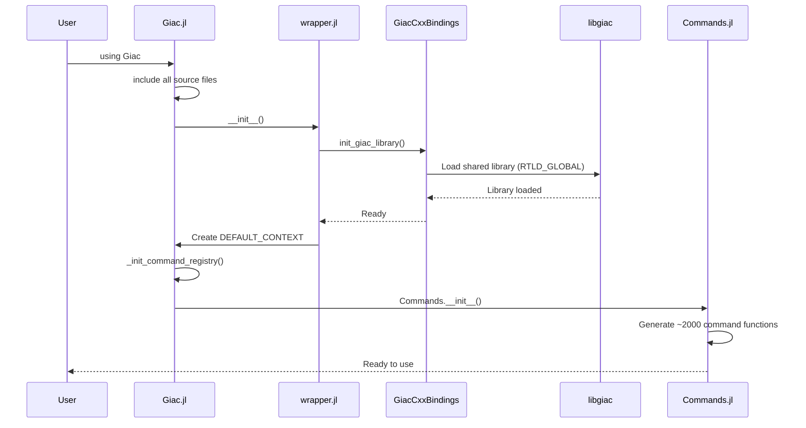
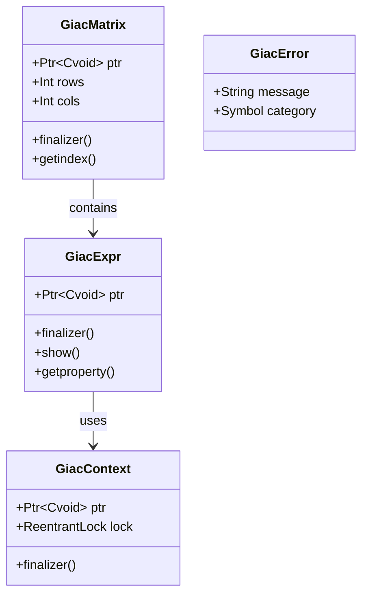
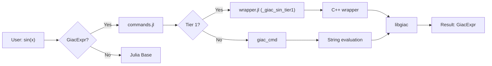
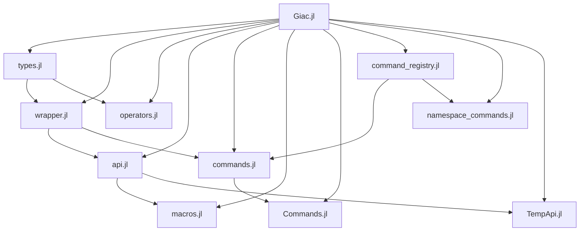

# Package Architecture

This page explains the internal structure of Giac.jl, helping developers understand how the package is organized and how components interact.

## Overview

Giac.jl wraps the GIAC computer algebra system (C++) for use in Julia. The package uses CxxWrap.jl for C++/Julia interoperability and provides a Julia-native API.



## Source File Reference

| File | Purpose | Key Exports | Dependencies |
|------|---------|-------------|--------------|
| `Giac.jl` | Main module entry point | `Giac` module | All other files |
| `types.jl` | Type definitions | `GiacExpr`, `GiacContext`, `GiacMatrix`, `GiacError` | None |
| `wrapper.jl` | CxxWrap bindings, Tier 1/2 functions | `_giac_eval_string`, `_giac_*_tier1` | types.jl |
| `api.jl` | High-level Julia API | `giac_eval`, `to_julia` | wrapper.jl, types.jl |
| `commands.jl` | Command invocation, Base extensions | `giac_cmd`, `Base.sin(::GiacExpr)` | wrapper.jl, types.jl |
| `Commands.jl` | Commands submodule | `invoke_cmd`, ~2000 command functions | commands.jl |
| `command_registry.jl` | Command discovery | `VALID_COMMANDS`, `suggest_commands` | None |
| `namespace_commands.jl` | Namespace-specific commands | Namespace command helpers | command_registry.jl |
| `operators.jl` | Arithmetic operators | `+`, `-`, `*`, `/`, `^` for GiacExpr | types.jl |
| `macros.jl` | User convenience macros | `@giac_var`, `@giac_several_vars` | api.jl |
| `utils.jl` | Helper utilities | Internal utilities | None |
| `TempApi.jl` | Temporary API submodule | TempApi functions | api.jl |

## Module Initialization

When `using Giac` is executed, the following initialization sequence occurs:



### What Happens in `__init__()`

1. **Library Loading**: `init_giac_library()` loads the C++ wrapper library with `RTLD_GLOBAL` flag to ensure proper symbol resolution
2. **Context Creation**: Creates `DEFAULT_CONTEXT`, the global evaluation context
3. **Command Registry**: Initializes the registry of valid GIAC commands
4. **Commands Module**: Dynamically generates wrapper functions for all GIAC commands

## Type System

Giac.jl defines four core types for working with GIAC:



### GiacExpr

The primary type representing a GIAC expression. Wraps a pointer to a C++ `giac::gen` object.

```julia
mutable struct GiacExpr
    ptr::Ptr{Cvoid}
end
```

- **Automatic memory management**: Uses Julia's finalizer to free C++ memory
- **Method-style syntax**: Supports `expr.factor()` which translates to `giac_cmd(:factor, expr)`
- **Display**: Implements `show` for text and LaTeX output

### GiacContext

Evaluation context managing computation state.

```julia
mutable struct GiacContext
    ptr::Ptr{Cvoid}
    lock::ReentrantLock
end
```

- **Thread safety**: Contains a `ReentrantLock` for concurrent access
- **Configuration**: Holds computation settings (precision, assumptions, etc.)

### GiacMatrix

Symbolic matrix type with dimension tracking.

```julia
mutable struct GiacMatrix
    ptr::Ptr{Cvoid}
    rows::Int
    cols::Int
end
```

- **Indexing**: Supports `m[i,j]` returning a `GiacExpr`
- **Construction**: Can be created from Julia arrays or symbolically

### GiacError

Exception type for GIAC-related errors.

```julia
struct GiacError <: Exception
    message::String
    category::Symbol  # :parse, :eval, :type, :memory
end
```

## Data Flow

A typical function call flows through the package like this:



## File Dependencies

Understanding which files depend on which helps when making changes:



## Where to Make Changes

| Change Type | Files to Modify |
|-------------|-----------------|
| Add a new high-performance function | `wrapper.jl` (Tier 1), `commands.jl` (Base extension) |
| Add a new type | `types.jl` |
| Extend an existing command | `commands.jl` or `Commands.jl` |
| Add a new macro | `macros.jl` |
| Modify operator behavior | `operators.jl` |
| Change initialization | `Giac.jl` (`__init__`) or `wrapper.jl` |
| Add API documentation | docstrings in relevant file |

## See Also

- [Performance Tiers](tier-system.md) - Deep dive into the tier system
- [Adding Functions](contributing.md) - Step-by-step contribution guide
- [Memory Management](memory.md) - How memory is managed
