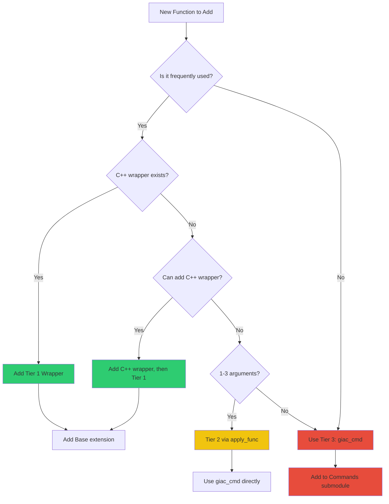

# Adding Functions to Giac.jl

This guide walks you through adding new mathematical functions to Giac.jl at each performance tier.

## Decision Tree

Use this flowchart to determine which tier to use for your new function:



## Step-by-Step: Adding a Tier 1 Function

Adding a Tier 1 function requires modifications to two files and provides the best performance.

### Prerequisites

1. Confirm the C++ function exists in `libgiac-julia-wrapper`
2. Know the function's arity (number of arguments)
3. Know the GIAC command name

### Step 1: Add the Tier 1 Wrapper

In `src/wrapper.jl`, add the wrapper function after the existing Tier 1 functions (around line 1038):

```julia
# For unary functions (1 argument)
_giac_sinh_tier1(expr_ptr::Ptr{Cvoid}) =
    _tier1_unary(GiacCxxBindings.giac_sinh, expr_ptr)

# For binary functions (2 arguments)
_giac_hypot_tier1(a_ptr::Ptr{Cvoid}, b_ptr::Ptr{Cvoid}) =
    _tier1_binary(GiacCxxBindings.giac_hypot, a_ptr, b_ptr)

# For ternary functions (3 arguments)
_giac_horner_tier1(a::Ptr{Cvoid}, b::Ptr{Cvoid}, c::Ptr{Cvoid}) =
    _tier1_ternary(GiacCxxBindings.giac_horner, a, b, c)
```

### Step 2: Add the Base Extension

In `src/commands.jl`, add the user-facing function (around line 330):

```julia
# For unary functions
Base.sinh(expr::GiacExpr)::GiacExpr =
    _tier1_or_fallback(_giac_sinh_tier1, :sinh, expr)

# For binary functions
Base.hypot(a::GiacExpr, b::GiacExpr)::GiacExpr =
    _tier1_or_fallback_binary(_giac_hypot_tier1, :hypot, a, b)
```

### Step 3: Export the Function (if needed)

If extending a `Base` function, no export is needed. For new functions, add to exports in `src/Giac.jl`:

```julia
export my_new_function
```

### Step 4: Add Tests

In `test/test_commands.jl`:

```julia
@testset "sinh function" begin
    x = giac_eval("x")

    # Test symbolic evaluation
    result = sinh(x)
    @test result isa GiacExpr
    @test string(result) == "sinh(x)"

    # Test numeric evaluation
    result_num = sinh(giac_eval("0"))
    @test to_julia(result_num) == 0
end
```

### Step 5: Add Documentation

Add a docstring to your function:

```julia
"""
    sinh(expr::GiacExpr) -> GiacExpr

Compute the hyperbolic sine of a GIAC expression.

# Examples
```jldoctest
julia> using Giac

julia> x = giac_eval("x")
x

julia> sinh(x)
sinh(x)
```
"""
Base.sinh(expr::GiacExpr)::GiacExpr =
    _tier1_or_fallback(_giac_sinh_tier1, :sinh, expr)
```

## Step-by-Step: Adding a Tier 2/3 Function

For functions that don't need maximum performance or don't have C++ wrappers.

### Option A: Using giac_cmd Directly

For occasional use, simply call `giac_cmd`:

```julia
# In your code
result = giac_cmd(:my_function, arg1, arg2)
```

### Option B: Adding to Commands Submodule

For functions you want accessible via `Giac.Commands`:

In `src/Commands.jl`, the functions are auto-generated from `VALID_COMMANDS`. To add a custom function:

```julia
# In src/Commands.jl or commands.jl
"""
    my_special_function(expr) -> GiacExpr

Compute something special.
"""
function my_special_function(expr::GiacExpr)::GiacExpr
    return giac_cmd(:my_special_function, expr)
end

export my_special_function
```

### Option C: Creating a Convenience Wrapper

For better ergonomics, create a dedicated function:

```julia
# In src/api.jl or a new file
"""
    partial_fractions(expr, var) -> GiacExpr

Compute partial fraction decomposition of `expr` with respect to `var`.
"""
function partial_fractions(expr::GiacExpr, var::GiacExpr)::GiacExpr
    return giac_cmd(:partfrac, expr, var)
end

export partial_fractions
```

## Extending Base Functions

When extending Julia's `Base` module functions, follow these guidelines:

### Pattern for GiacExpr

```julia
# Correct: Use _tier1_or_fallback when Tier 1 exists
Base.sin(expr::GiacExpr)::GiacExpr =
    _tier1_or_fallback(_giac_sin_tier1, :sin, expr)

# Correct: Use giac_cmd when no Tier 1
Base.sinc(expr::GiacExpr)::GiacExpr =
    giac_cmd(:sinc, expr)
```

### Avoiding Type Piracy

Only extend Base functions for types you own (GiacExpr, GiacMatrix):

```julia
# Good: Extending for our type
Base.sin(expr::GiacExpr) = ...

# Bad: This would be type piracy
Base.sin(x::Float64) = ...  # Don't do this!
```

### Method Signatures

Match Julia's expected signatures where possible:

```julia
# Good: Matches Base.diff signature pattern
Base.diff(f::GiacExpr, x::GiacExpr) = giac_diff(f, x)

# For multiple dispatch
Base.diff(f::GiacExpr, x::GiacExpr, n::Integer) = giac_diff(f, x, n)
```

## Complete Example: Adding `sinh`

Here's a complete example of adding the hyperbolic sine function.

### 1. Check C++ Availability

First, verify `giac_sinh` exists in `GiacCxxBindings`:

```julia
# In Julia REPL
using Giac
hasmethod(Giac.GiacCxxBindings.giac_sinh, Tuple{Any})
```

### 2. Add Tier 1 Wrapper (wrapper.jl)

```julia
# Add after line ~1037 in wrapper.jl

# Hyperbolic trigonometry (Tier 1)
_giac_sinh_tier1(expr_ptr::Ptr{Cvoid}) =
    _tier1_unary(GiacCxxBindings.giac_sinh, expr_ptr)
_giac_cosh_tier1(expr_ptr::Ptr{Cvoid}) =
    _tier1_unary(GiacCxxBindings.giac_cosh, expr_ptr)
_giac_tanh_tier1(expr_ptr::Ptr{Cvoid}) =
    _tier1_unary(GiacCxxBindings.giac_tanh, expr_ptr)
```

### 3. Add Base Extension (commands.jl)

```julia
# Add after line ~330 in commands.jl

# Hyperbolic functions
"""
    sinh(expr::GiacExpr) -> GiacExpr

Compute the hyperbolic sine of a GIAC expression.

# Examples
```jldoctest
julia> using Giac

julia> sinh(giac_eval("0"))
0
```
"""
Base.sinh(expr::GiacExpr)::GiacExpr =
    _tier1_or_fallback(_giac_sinh_tier1, :sinh, expr)

Base.cosh(expr::GiacExpr)::GiacExpr =
    _tier1_or_fallback(_giac_cosh_tier1, :cosh, expr)

Base.tanh(expr::GiacExpr)::GiacExpr =
    _tier1_or_fallback(_giac_tanh_tier1, :tanh, expr)
```

### 4. Add Tests (test/test_commands.jl)

```julia
@testset "Hyperbolic functions" begin
    x = giac_eval("x")

    @testset "sinh" begin
        @test sinh(x) isa GiacExpr
        @test string(sinh(x)) == "sinh(x)"
        @test to_julia(sinh(giac_eval("0"))) == 0
    end

    @testset "cosh" begin
        @test cosh(x) isa GiacExpr
        @test to_julia(cosh(giac_eval("0"))) == 1
    end

    @testset "tanh" begin
        @test tanh(x) isa GiacExpr
        @test to_julia(tanh(giac_eval("0"))) == 0
    end
end
```

### 5. Run Tests

```bash
julia --project -e 'using Pkg; Pkg.test()'
```

## Checklist for Adding Functions

- [ ] Determine the appropriate tier (1, 2, or 3)
- [ ] If Tier 1: Add wrapper in `wrapper.jl`
- [ ] Add user-facing function in `commands.jl` or `api.jl`
- [ ] Add docstring with examples
- [ ] Add tests in `test/`
- [ ] Run test suite
- [ ] Update documentation if needed

## See Also

- [Performance Tiers](tier-system.md) - Detailed tier system explanation
- [Package Architecture](architecture.md) - Where files are located
- [Memory Management](memory.md) - Important for wrapped types
