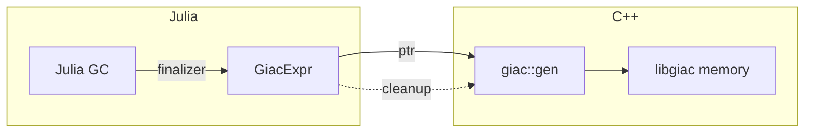

# Memory Management

This guide explains how Giac.jl manages memory for C++ objects, ensuring safe interoperation between Julia's garbage collector and GIAC's memory model.

## Overview

Giac.jl wraps C++ objects from the GIAC library. Since Julia's garbage collector doesn't know about C++ memory, we use Julia's finalizer mechanism to ensure proper cleanup.



### Key Principles

1. **Every C++ allocation has a corresponding deallocation**
2. **Finalizers ensure cleanup when Julia objects are garbage collected**
3. **Raw pointers are never exposed in the public API**
4. **Thread safety is ensured via locks**

## GiacExpr Lifecycle

Understanding the lifecycle of a `GiacExpr` is essential for safe development.

```mermaid
sequenceDiagram
    participant User
    participant GiacExpr
    participant Finalizer
    participant C++

    User->>C++: giac_eval("x^2")
    C++-->>GiacExpr: Create with ptr
    Note over GiacExpr: Register finalizer

    User->>GiacExpr: Use expression
    GiacExpr->>C++: Operations via ptr

    Note over User: GiacExpr goes out of scope
    User->>GiacExpr: (unreachable)

    Note over GiacExpr: Julia GC runs
    GiacExpr->>Finalizer: Trigger finalizer
    Finalizer->>C++: _giac_free_expr(ptr)
    C++-->>Finalizer: Memory freed
```

### Creation

When a `GiacExpr` is created, a finalizer is automatically registered:

```julia
# In types.jl
mutable struct GiacExpr
    ptr::Ptr{Cvoid}

    function GiacExpr(ptr::Ptr{Cvoid})
        expr = new(ptr)
        finalizer(_finalize_giacexpr, expr)  # Register cleanup
        return expr
    end
end
```

### Usage

During its lifetime, the `GiacExpr` can be used normally:

```julia
x = giac_eval("x")
y = sin(x) + cos(x)  # Creates new GiacExpr objects
result = y.simplify()  # Method-style syntax also works
```

### Finalization

When the Julia GC determines the object is unreachable, the finalizer runs:

```julia
function _finalize_giacexpr(expr::GiacExpr)
    if expr.ptr != C_NULL
        _giac_free_expr(expr.ptr)  # Call C++ destructor
        expr.ptr = C_NULL  # Prevent double-free
    end
end
```

## Finalizer Functions

Giac.jl defines three finalizer functions for its wrapped types.

### `_finalize_giacexpr`

Cleans up GIAC expression objects.

```julia
function _finalize_giacexpr(expr::GiacExpr)
    if expr.ptr != C_NULL
        _giac_free_expr(expr.ptr)
        expr.ptr = C_NULL
    end
end
```

**Called when**: A `GiacExpr` object is garbage collected.

### `_finalize_giaccontext`

Cleans up GIAC context objects.

```julia
function _finalize_giaccontext(ctx::GiacContext)
    if ctx.ptr != C_NULL
        _giac_free_context(ctx.ptr)
        ctx.ptr = C_NULL
    end
end
```

**Called when**: A `GiacContext` object is garbage collected.

**Note**: The `DEFAULT_CONTEXT` is never garbage collected during normal operation since it's referenced by the module.

### `_finalize_giacmatrix`

Cleans up GIAC matrix objects.

```julia
function _finalize_giacmatrix(m::GiacMatrix)
    if m.ptr != C_NULL
        _giac_free_matrix(m.ptr)
        m.ptr = C_NULL
    end
end
```

**Called when**: A `GiacMatrix` object is garbage collected.

## Thread Safety

GIAC is not inherently thread-safe, so Giac.jl uses locks to prevent concurrent access.

### The `with_giac_lock` Pattern

All evaluation operations use `with_giac_lock`:

```julia
function with_giac_lock(f::Function, ctx::GiacContext=DEFAULT_CONTEXT)
    lock(ctx.lock)
    try
        return f()
    finally
        unlock(ctx.lock)
    end
end
```

### Usage in Code

```julia
# In commands.jl
function giac_cmd(cmd::Symbol, args...)::GiacExpr
    # ... argument processing ...

    return with_giac_lock() do
        giac_eval(cmd_string)
    end
end
```

### GiacContext Lock

Each `GiacContext` contains a `ReentrantLock`:

```julia
mutable struct GiacContext
    ptr::Ptr{Cvoid}
    lock::ReentrantLock  # For thread safety

    function GiacContext(ptr::Ptr{Cvoid})
        ctx = new(ptr, ReentrantLock())
        finalizer(_finalize_giaccontext, ctx)
        return ctx
    end
end
```

**Why ReentrantLock?**: Allows the same thread to acquire the lock multiple times (nested calls), which is necessary for complex expression evaluation.

## Best Practices

### Do: Use Finalizers for New Types

If you create a new type that wraps C++ memory:

```julia
mutable struct MyNewType
    ptr::Ptr{Cvoid}

    function MyNewType(ptr::Ptr{Cvoid})
        obj = new(ptr)
        finalizer(_finalize_mynewtype, obj)  # Always register!
        return obj
    end
end

function _finalize_mynewtype(obj::MyNewType)
    if obj.ptr != C_NULL
        _my_free_function(obj.ptr)
        obj.ptr = C_NULL
    end
end
```

### Do: Check for Null Pointers

Always check before using pointers:

```julia
function safe_operation(expr::GiacExpr)
    if expr.ptr == C_NULL
        throw(GiacError("Expression has been freed", :memory))
    end
    # ... proceed with operation
end
```

### Do: Use the Lock for Evaluation

Always use `with_giac_lock` when calling GIAC:

```julia
function my_custom_eval(expr::GiacExpr)
    return with_giac_lock() do
        # All GIAC calls inside the lock
        result = giac_eval(string(expr))
        return result
    end
end
```

### Don't: Expose Raw Pointers

Never expose `Ptr{Cvoid}` in public API:

```julia
# Bad: Exposes internal pointer
function get_ptr(expr::GiacExpr)
    return expr.ptr  # Don't do this!
end

# Good: Return wrapped type or Julia value
function get_value(expr::GiacExpr)
    return to_julia(expr)  # Returns proper Julia type
end
```

### Don't: Hold References Across Threads

Avoid sharing `GiacExpr` between threads without proper synchronization:

```julia
# Risky: expr shared across threads
@threads for i in 1:10
    result = sin(expr)  # Race condition!
end

# Better: Create local copies or use proper synchronization
results = Vector{GiacExpr}(undef, 10)
@threads for i in 1:10
    local_expr = giac_eval(string(expr))  # Local copy
    results[i] = sin(local_expr)
end
```

### Don't: Manually Free Memory

Let finalizers handle cleanup:

```julia
# Bad: Manual memory management
expr = giac_eval("x")
_giac_free_expr(expr.ptr)  # Don't do this!
expr.ptr = C_NULL

# Good: Let Julia GC handle it
expr = giac_eval("x")
# Just let it go out of scope
```

## Common Pitfalls

### Memory Leaks

**Symptom**: Memory usage grows over time without bound.

**Cause**: Finalizers not registered, or C++ objects created without wrapping.

**Fix**: Ensure every `Ptr{Cvoid}` from C++ is wrapped in a Julia type with a finalizer.

### Dangling Pointers

**Symptom**: Segmentation fault or garbage values.

**Cause**: Using a pointer after its memory has been freed.

**Fix**: Always check for `C_NULL` before using pointers; don't manually free memory.

### Race Conditions

**Symptom**: Intermittent crashes or wrong results with multithreading.

**Cause**: Multiple threads accessing GIAC without synchronization.

**Fix**: Use `with_giac_lock` for all GIAC operations.

### Double Free

**Symptom**: Crash with "double free or corruption" error.

**Cause**: Memory freed twice, often from manual `_giac_free_*` calls.

**Fix**: Never call free functions manually; let finalizers handle it. Set pointer to `C_NULL` in finalizer to prevent double-free.

## Debugging Memory Issues

### Using Julia's GC

Force garbage collection to trigger finalizers:

```julia
GC.gc()  # Run garbage collector
```

### Checking for Leaks

Monitor memory usage:

```julia
function memory_test()
    initial = Sys.maxrss()
    for i in 1:10000
        x = giac_eval("x^$i")
    end
    GC.gc()
    final = Sys.maxrss()
    println("Memory change: $(final - initial) bytes")
end
```

### Pointer Validation

Check if a pointer is valid:

```julia
function is_valid(expr::GiacExpr)
    return expr.ptr != C_NULL
end
```

## See Also

- [Package Architecture](architecture.md) - Type definitions in types.jl
- [Troubleshooting](troubleshooting.md) - Debugging memory-related errors
- [Performance Tiers](tier-system.md) - How tier wrappers handle pointers
