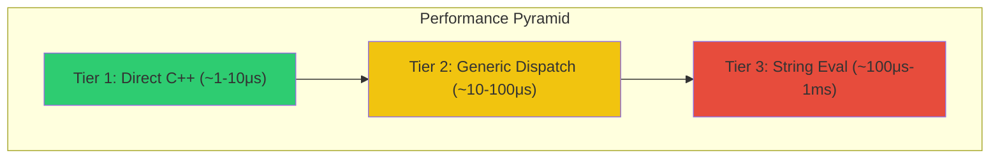
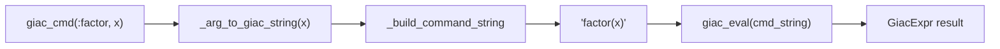
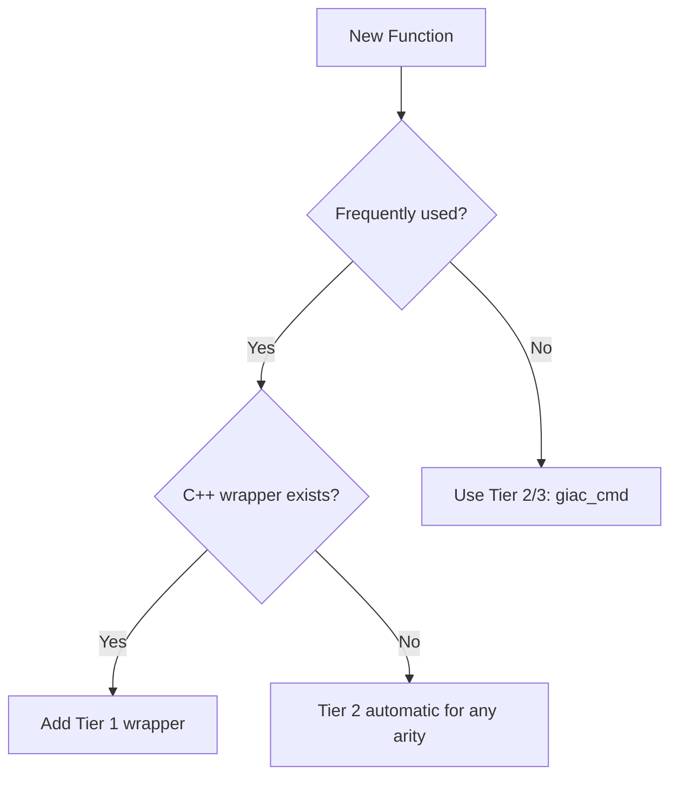

# Performance Tier System

Giac.jl uses a three-tier performance system to balance execution speed with flexibility. Understanding this system is essential for contributing efficiently.

## Overview



| Tier | Mechanism | Performance | Use Case |
|------|-----------|-------------|----------|
| **Tier 1** | Direct C++ function call | Fastest (~1-10μs) | Frequently-used mathematical functions |
| **Tier 2** | Generic `apply_funcN` dispatch | Medium (~10-100μs) | Functions with C++ wrappers, any arity |
| **Tier 3** | String concatenation & eval | Slowest (~100μs-1ms) | All 2200+ GIAC commands (fallback) |

## Tier 1: Direct C++ Wrappers

Tier 1 provides the highest performance by calling C++ functions directly through CxxWrap bindings, with no name lookup or string processing.

### How It Works

```julia
# In wrapper.jl
_giac_sin_tier1(expr_ptr::Ptr{Cvoid}) =
    _tier1_unary(GiacCxxBindings.giac_sin, expr_ptr)
```

The `_tier1_unary` helper:
1. Converts the pointer to a GIAC `gen` object
2. Calls the C++ function directly
3. Converts the result back to a pointer

### Helper Functions

Located in `wrapper.jl`:

| Helper | Arity | Lines |
|--------|-------|-------|
| `_tier1_unary(func, ptr)` | 1 argument | 946-959 |
| `_tier1_binary(func, a, b)` | 2 arguments | 961-976 |
| `_tier1_ternary(func, a, b, c)` | 3 arguments | 978-995 |

### Complete Tier 1 Function List

**Trigonometric** (6 functions):
- `_giac_sin_tier1`, `_giac_cos_tier1`, `_giac_tan_tier1`
- `_giac_asin_tier1`, `_giac_acos_tier1`, `_giac_atan_tier1`

**Exponential/Logarithmic** (4 functions):
- `_giac_exp_tier1`, `_giac_ln_tier1`, `_giac_log10_tier1`, `_giac_sqrt_tier1`

**Arithmetic** (4 functions):
- `_giac_abs_tier1`, `_giac_sign_tier1`, `_giac_floor_tier1`, `_giac_ceil_tier1`

**Complex Numbers** (3 functions):
- `_giac_re_tier1`, `_giac_im_tier1`, `_giac_conj_tier1`

**Algebraic** (2 functions):
- `_giac_normal_tier1`, `_giac_evalf_tier1`

**Calculus** (6 functions):
- `_giac_diff_tier1` (binary), `_giac_integrate_tier1` (binary)
- `_giac_subst_tier1` (ternary), `_giac_solve_tier1` (binary)
- `_giac_limit_tier1` (ternary), `_giac_series_tier1` (ternary)

**Binary Operations** (3 functions):
- `_giac_gcd_tier1`, `_giac_lcm_tier1`, `_giac_pow_tier1`

## Tier 2: Generic C++ Dispatch

Tier 2 uses C++ generic dispatch functions (`apply_func0`, `apply_func1`, `apply_func2`, `apply_func3`, `apply_funcN`) to call GIAC functions by name with moderate overhead.

### Available Functions

| Function | Arity | Description |
|----------|-------|-------------|
| `apply_func0(name)` | 0 | Zero-argument functions (e.g., `rand()`) |
| `apply_func1(name, arg)` | 1 | Single-argument functions |
| `apply_func2(name, arg1, arg2)` | 2 | Two-argument functions |
| `apply_func3(name, arg1, arg2, arg3)` | 3 | Three-argument functions |
| `apply_funcN(name, args)` | N | N-argument functions via `StdVector{Gen}` |

### How It Works

```julia
# In wrapper.jl
function _apply_func_generic(name::String, args::Vector{String})::Ptr{Cvoid}
    gen_args = [GiacCxxBindings.giac_eval(arg) for arg in args]

    result_gen = if length(gen_args) == 0
        GiacCxxBindings.apply_func0(name)
    elseif length(gen_args) == 1
        GiacCxxBindings.apply_func1(name, gen_args[1])
    elseif length(gen_args) == 2
        GiacCxxBindings.apply_func2(name, gen_args[1], gen_args[2])
    elseif length(gen_args) == 3
        GiacCxxBindings.apply_func3(name, gen_args[1], gen_args[2], gen_args[3])
    else
        # N>3 args: use apply_funcN with StdVector
        std_vec = GiacCxxBindings.StdVector{GiacCxxBindings.Gen}()
        for g in gen_args
            push!(std_vec, g)
        end
        GiacCxxBindings.apply_funcN(name, std_vec)
    end

    return _make_stub_ptr(GiacCxxBindings.to_string(result_gen))
end
```

### Examples of N-ary Functions (4+ parameters)

```julia
# series(expr, var, point, order) - 4 params
giac_eval("series(exp(x),x,0,4)")  # Taylor expansion

# sum(expr, var, start, end) - 4 params
giac_eval("sum(k,k,1,10)")  # = 55

# product(expr, var, start, end) - 4 params
giac_eval("product(k,k,1,5)")  # = 120

# seq(expr, var, start, end) - 4 params
giac_eval("seq(k^2,k,1,5)")  # = [1,4,9,16,25]
```

### When Tier 2 Is Used

- Functions with any number of arguments that don't have Tier 1 wrappers
- Automatic fallback when Tier 1 fails
- When `giac_cmd` is called

## Tier 3: String Evaluation

Tier 3 is the universal fallback that works for all 2200+ GIAC commands by building a command string and evaluating it.

### How It Works



### The Command Flow

Located in `command_utils.jl` (lines 109-143):

```julia
function giac_cmd(cmd::Symbol, args...)::GiacExpr
    cmd_str = string(cmd)

    # 1. Validate command exists
    if !isempty(VALID_COMMANDS) && cmd_str ∉ VALID_COMMANDS
        throw(GiacError("Unknown command: $cmd_str", :eval))
    end

    # 2. Convert arguments to strings
    arg_strings = [_arg_to_giac_string(arg) for arg in args]

    # 3. Build command string: "factor(x^2-1)"
    cmd_string = _build_command_string(cmd_str, arg_strings)

    # 4. Evaluate with thread safety
    return with_giac_lock() do
        giac_eval(cmd_string)
    end
end
```

### Argument Conversion

The `_arg_to_giac_string` function (lines 20-43) handles various types:

| Type | Conversion |
|------|------------|
| `GiacExpr` | `string(expr)` |
| `String` | Pass through |
| `Number` | `string(n)` |
| `Symbol` | `string(sym)` |
| `AbstractVector` | `"[elem1,elem2,...]"` |

## The `_tier1_or_fallback` Pattern

This pattern elegantly bridges Tier 1 and Tier 3, trying the fast path first and falling back if needed.

### Implementation

Located in `command_utils.jl` (lines 152-180):

```julia
function _tier1_or_fallback(tier1_func::Function, cmd::Symbol, expr::GiacExpr)::GiacExpr
    result_ptr = tier1_func(expr.ptr)
    if result_ptr != C_NULL
        return GiacExpr(result_ptr)  # Tier 1 succeeded
    end
    return giac_cmd(cmd, expr)  # Fall back to Tier 3
end

function _tier1_or_fallback_binary(tier1_func, cmd, a::GiacExpr, b::GiacExpr)
    result_ptr = tier1_func(a.ptr, b.ptr)
    if result_ptr != C_NULL
        return GiacExpr(result_ptr)
    end
    return giac_cmd(cmd, a, b)
end

function _tier1_or_fallback_ternary(tier1_func, cmd, a, b, c)
    result_ptr = tier1_func(a.ptr, b.ptr, c.ptr)
    if result_ptr != C_NULL
        return GiacExpr(result_ptr)
    end
    return giac_cmd(cmd, a, b, c)
end
```

### Usage in Base Extensions

```julia
# In command_utils.jl - extending Julia's Base functions
Base.sin(expr::GiacExpr)::GiacExpr =
    _tier1_or_fallback(_giac_sin_tier1, :sin, expr)

Base.gcd(a::GiacExpr, b::GiacExpr)::GiacExpr =
    _tier1_or_fallback_binary(_giac_gcd_tier1, :gcd, a, b)
```

## Performance Implications

### Choosing the Right Tier



### Performance Comparison

| Operation | Tier 1 | Tier 2 | Tier 3 |
|-----------|--------|--------|--------|
| Simple unary (sin, cos) | ~2μs | ~20μs | ~200μs |
| Binary (gcd, pow) | ~3μs | ~25μs | ~250μs |
| Complex expression | ~5μs | ~50μs | ~500μs |

*Note: Actual performance varies by system and expression complexity*

### When Tier Fallback Occurs

Tier 1 falls back to Tier 3 when:
- The C++ function returns an error
- Memory allocation fails
- The library is in stub mode (testing)

Tier 2 falls back to Tier 3 when:
- Generic dispatch fails
- An exception occurs during evaluation

## Determining Which Tier Is Used

To predict which tier handles a function call:

1. **Check if it's a Base extension** (sin, cos, sqrt, etc.):
   - If Tier 1 function exists → Tier 1 with fallback
   - Otherwise → Tier 2/3

2. **Using `giac_cmd` directly**:
   - Any arity with C++ support → Tier 2
   - Fallback on error → Tier 3

3. **Using Commands submodule** (`using Giac.Commands: factor`):
   - Goes through `invoke_cmd` → Tier 2/3

## See Also

- [Adding Functions](contributing.md) - How to add functions at each tier
- [Package Architecture](architecture.md) - Overall package structure
