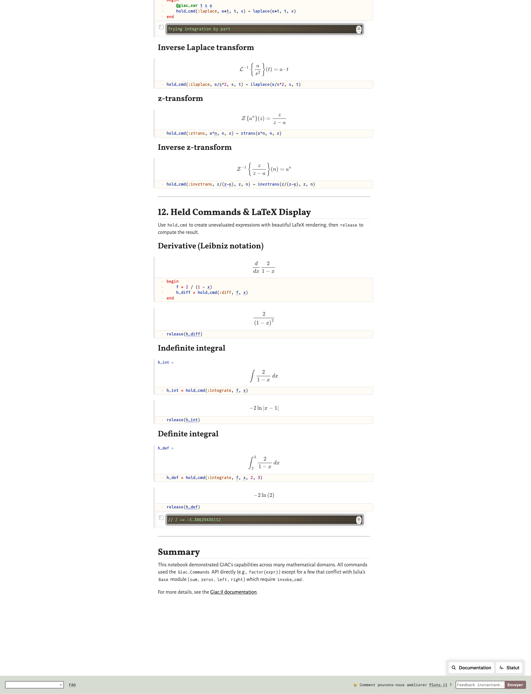

# Using Giac.jl with Pluto reactive notebook

## LaTeX Rendering in Pluto

GiacExpr and GiacMatrix automatically render as LaTeX in Pluto notebooks! No extra conversion needed:

```julia
using Giac

f = giac_eval("2/(1-x)")  # Automatically displays as LaTeX fraction
df = invoke_cmd(:diff, f, giac_eval("x"))  # Derivative also renders as LaTeX

M = GiacMatrix([1 2; 3 4])  # Matrices render as LaTeX too
```

This works because Giac.jl implements `Base.show(io, ::MIME"text/latex", expr)` which calls GIAC's native `latex` command.

A demo notebook is available at `examples/latex_demo.jl`:

```julia
using Pluto
Pluto.run(notebook="examples/latex_demo.jl")
```

See screenshots:



