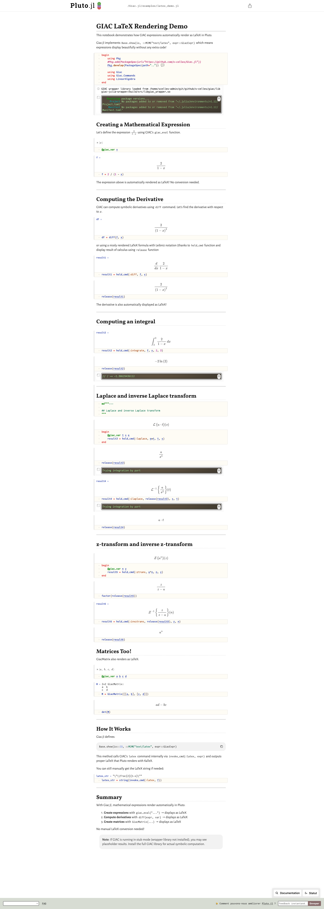
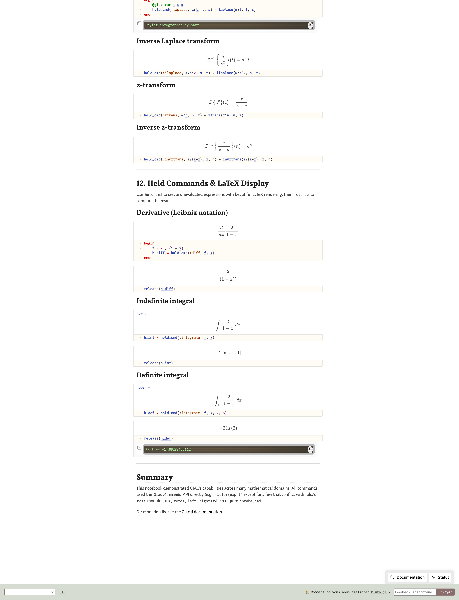

# Using Giac.jl with Pluto reactive notebook

## LaTeX Rendering in Pluto

GiacExpr and GiacMatrix automatically render as LaTeX in Pluto notebooks! No extra conversion needed:

```julia
using Giac

f = giac_eval("2/(1-x)")  # Automatically displays as LaTeX fraction
df = invoke_cmd(:diff, f, giac_eval("x"))  # Derivative also renders as LaTeX

M = GiacMatrix([1 2; 3 4])  # Matrices render as LaTeX too
```

This works because Giac.jl implements `Base.show(io, ::MIME"text/latex", expr)` which calls Giac's native `latex` command.

## Rendering preserves the expression you computed

GIAC evaluates the arguments of every command, and not every result is a fixed
point of evaluation. The integer factorization `ifactor(360)` is the product
`2^3*3^2*5`, which evaluates straight back to `360`. Giac.jl therefore quotes
`GiacExpr` arguments passed to the rendering commands (`latex` and `mathml`),
so they typeset the expression as it stands instead of a re-evaluated copy:

```julia
using Giac
using Giac.Commands: ifactor, latex

f = ifactor(360)   # 2^3*3^2*5
latex(f)           # "5\cdot 2^{3}\cdot 3^{2}"  (not "360")
```

The same holds for notebook display, so an `ifactor` result shows the
factorization rather than the original number in any frontend that consumes
the `text/latex` MIME type — Pluto, Jupyter, or KaimonSlate:

```julia
ifactor(360)       # renders as 5·2³·3²
```

Every other command keeps GIAC's normal evaluation semantics — only `latex`
and `mathml` hold their argument, because they are the ones whose job is to
show an expression rather than compute with it.

A demo notebook is available at `examples/02_latex.jl`:

```julia
using Pluto
Pluto.run(notebook="examples/02_latex.jl")
```

See screenshots:





